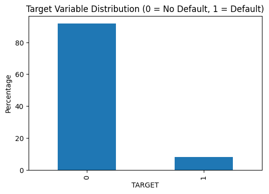

# Credit Information Analysis

## Overview
This project provides a comprehensive analysis of credit information data, focusing on understanding, cleaning, exploring, and visualizing key aspects relevant to credit risk and default prediction. The repository is structured to support exploratory data analysis (EDA), issue identification, and reporting for a credit dataset, with a strong emphasis on reproducibility and clarity.

## Competition Outline
This assignment is based on a credit risk prediction competition. The objective is to analyze a dataset containing customer credit information and identify factors that influence default risk. The project involves:
- Understanding the dataset structure and variables
- Identifying and addressing data quality issues
- Exploring relationships between features and the target variable (default)
- Summarizing findings and proposing actionable insights

## Data Appearance & Understanding
The dataset consists of various features related to customer demographics, financial status, and credit history. Typical columns include:
- `ID`: Unique customer identifier
- `Age`: Customer age
- `Income`: Annual income
- `Credit Amount`: Amount of credit granted
- `Contract Type`: Type of credit contract
- `Target`: Default indicator (binary)

A sample of the data can be found in the `data/` directory. For a detailed summary of columns, missing values, and data types, refer to `reports/problem2_summary.md` and `reports/problem2_missing_values.csv`.

## Setting Issues
During analysis, several issues were identified:
- **Missing Values:** Some columns contain missing or incomplete data.
- **Data Types:** Certain columns may require type conversion for proper analysis.
- **Outliers:** Extreme values in income, age, or credit amount may affect results.
- **Imbalanced Target:** The default indicator may be imbalanced, impacting model performance.

These issues are documented in `reports/problem3_define_issues.md` and explored in the EDA notebook.

## Data Search & Exploration
Data exploration was performed using:
- **Jupyter Notebook (`notebooks/credit_eda.ipynb`):** Interactive analysis of distributions, correlations, and relationships.
- **Scripts in `src/`:** Automated data overview, missing value analysis, and feature engineering.
- **Visualizations in `plots/`:** Key plots for target distribution, age vs default, contract type vs default, correlation heatmap, credit amount vs target, and income vs target.

## Project Structure
```
credit-information-analysis/
├── build_notebook.py                # Script to build or manage notebooks
├── main.py                          # Main entry point for project execution
├── README.md                        # Project documentation
├── requirements.txt                 # Python dependencies
├── data/                            # Raw and processed data files
├── notebooks/
│   └── credit_eda.ipynb             # Jupyter notebook for EDA
├── plots/                           # Generated visualizations
│   ├── problem2_target_distribution.png
│   ├── problem4_age_vs_default.png
│   ├── problem4_contract_vs_default.png
│   ├── problem4_corr_heatmap.png
│   ├── problem4_credit_vs_target.png
│   └── problem4_income_vs_target.png
├── reports/                         # Markdown and CSV reports
│   ├── problem1_understanding.md
│   ├── problem2_missing_values.csv
│   ├── problem2_summary.md
│   ├── problem3_define_issues.md
│   ├── problem3_questions.csv
│   ├── problem4_contract_vs_default.csv
│   ├── problem4_corr_matrix.csv
│   ├── problem4_findings.md
│   └── problem5_reflection.md
└── src/                             # Source code modules
    ├── problem2_data_overview.py
    └── problem4_data_exploration.py
```

## Features
- **Exploratory Data Analysis (EDA):**
    - Jupyter notebook (`notebooks/credit_eda.ipynb`) for interactive data exploration.
    - Visualizations in `plots/` for key relationships and distributions.
- **Data Overview & Cleaning:**
    - Scripts in `src/` for summarizing and cleaning data, handling missing values, and generating overviews.
- **Reporting:**
    - Markdown and CSV reports in `reports/` documenting findings, issues, and reflections.
- **Reproducibility:**
    - All code and analysis steps are versioned and documented for easy reproduction.

## Getting Started

### Prerequisites
- Python 3.8+
- Recommended: [Anaconda](https://www.anaconda.com/products/distribution) or [Miniconda](https://docs.conda.io/en/latest/miniconda.html) for environment management

### Installation
1. **Clone the repository:**
    ```powershell
    git clone https://github.com/oktakarisa/credit-information-analysis.git
    cd credit-information-analysis
    ```
2. **Create and activate a virtual environment (optional but recommended):**
    ```powershell
    python -m venv venv
    .\venv\Scripts\activate
    ```
3. **Install dependencies:**
    ```powershell
    pip install -r requirements.txt
    ```

### Usage
- **Run main analysis:**
    ```powershell
    python main.py
    ```
- **Explore data interactively:**
    Open `notebooks/credit_eda.ipynb` in Jupyter Notebook or VS Code and run the cells.
- **Generate or update reports/plots:**
    Use scripts in `src/` or run `build_notebook.py` as needed.

## Data
- Place raw or processed data files in the `data/` directory.
- Data sources and formats should be documented in the relevant report markdown files.

## Reports & Visualizations

### Key Plots

Below are the main visualizations generated by the analysis. These images are automatically rendered on GitHub for quick reference:

#### Target Distribution


#### Age vs Default


#### Contract Type vs Default


#### Correlation Heatmap


#### Credit Amount vs Target


#### Income vs Target


### Reports
- Markdown files in `reports/` provide detailed documentation of each analysis step, findings, and reflections.
- CSV files summarize missing values, questions, and correlation matrices.

## Source Code
- **`src/problem2_data_overview.py`:** Data overview and missing value analysis.
- **`src/problem4_data_exploration.py`:** Advanced data exploration and visualization.
- **`build_notebook.py`:** Utility for notebook management.
- **`main.py`:** Main script to orchestrate analysis workflow.

## Contributing
Contributions are welcome! Please follow these steps:
1. Fork the repository
2. Create a new branch (`git checkout -b feature/your-feature`)
3. Commit your changes
4. Push to your branch and open a pull request

## License
This project is licensed under the MIT License. See the [LICENSE](LICENSE) file for details.

## Contact
For questions or feedback, please contact the repository owner via GitHub Issues or Discussions.

---


## Author

**Assignment:** Iris Data Assignment

**Name:** Victor Karisa

**Date:** 02/10/2025


*Credit Information Analysis - Professional Data Science Project Template*