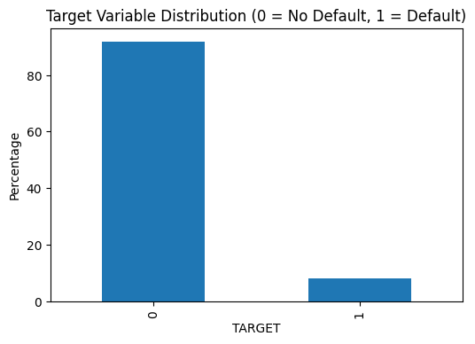

# Problem 2 – Data Overview

## Head of Data
|    |   SK_ID_CURR |   TARGET | NAME_CONTRACT_TYPE   | CODE_GENDER   | FLAG_OWN_CAR   | FLAG_OWN_REALTY   |   CNT_CHILDREN |   AMT_INCOME_TOTAL |      AMT_CREDIT |   AMT_ANNUITY |   AMT_GOODS_PRICE | NAME_TYPE_SUITE   | NAME_INCOME_TYPE   | NAME_EDUCATION_TYPE           | NAME_FAMILY_STATUS   | NAME_HOUSING_TYPE   |   REGION_POPULATION_RELATIVE |   DAYS_BIRTH |   DAYS_EMPLOYED |   DAYS_REGISTRATION |   DAYS_ID_PUBLISH |   OWN_CAR_AGE |   FLAG_MOBIL |   FLAG_EMP_PHONE |   FLAG_WORK_PHONE |   FLAG_CONT_MOBILE |   FLAG_PHONE |   FLAG_EMAIL | OCCUPATION_TYPE   |   CNT_FAM_MEMBERS |   REGION_RATING_CLIENT |   REGION_RATING_CLIENT_W_CITY | WEEKDAY_APPR_PROCESS_START   |   HOUR_APPR_PROCESS_START |   REG_REGION_NOT_LIVE_REGION |   REG_REGION_NOT_WORK_REGION |   LIVE_REGION_NOT_WORK_REGION |   REG_CITY_NOT_LIVE_CITY |   REG_CITY_NOT_WORK_CITY |   LIVE_CITY_NOT_WORK_CITY | ORGANIZATION_TYPE      |   EXT_SOURCE_1 |   EXT_SOURCE_2 |   EXT_SOURCE_3 |   APARTMENTS_AVG |   BASEMENTAREA_AVG |   YEARS_BEGINEXPLUATATION_AVG |   YEARS_BUILD_AVG |   COMMONAREA_AVG |   ELEVATORS_AVG |   ENTRANCES_AVG |   FLOORSMAX_AVG |   FLOORSMIN_AVG |   LANDAREA_AVG |   LIVINGAPARTMENTS_AVG |   LIVINGAREA_AVG |   NONLIVINGAPARTMENTS_AVG |   NONLIVINGAREA_AVG |   APARTMENTS_MODE |   BASEMENTAREA_MODE |   YEARS_BEGINEXPLUATATION_MODE |   YEARS_BUILD_MODE |   COMMONAREA_MODE |   ELEVATORS_MODE |   ENTRANCES_MODE |   FLOORSMAX_MODE |   FLOORSMIN_MODE |   LANDAREA_MODE |   LIVINGAPARTMENTS_MODE |   LIVINGAREA_MODE |   NONLIVINGAPARTMENTS_MODE |   NONLIVINGAREA_MODE |   APARTMENTS_MEDI |   BASEMENTAREA_MEDI |   YEARS_BEGINEXPLUATATION_MEDI |   YEARS_BUILD_MEDI |   COMMONAREA_MEDI |   ELEVATORS_MEDI |   ENTRANCES_MEDI |   FLOORSMAX_MEDI |   FLOORSMIN_MEDI |   LANDAREA_MEDI |   LIVINGAPARTMENTS_MEDI |   LIVINGAREA_MEDI |   NONLIVINGAPARTMENTS_MEDI |   NONLIVINGAREA_MEDI | FONDKAPREMONT_MODE   | HOUSETYPE_MODE   |   TOTALAREA_MODE | WALLSMATERIAL_MODE   | EMERGENCYSTATE_MODE   |   OBS_30_CNT_SOCIAL_CIRCLE |   DEF_30_CNT_SOCIAL_CIRCLE |   OBS_60_CNT_SOCIAL_CIRCLE |   DEF_60_CNT_SOCIAL_CIRCLE |   DAYS_LAST_PHONE_CHANGE |   FLAG_DOCUMENT_2 |   FLAG_DOCUMENT_3 |   FLAG_DOCUMENT_4 |   FLAG_DOCUMENT_5 |   FLAG_DOCUMENT_6 |   FLAG_DOCUMENT_7 |   FLAG_DOCUMENT_8 |   FLAG_DOCUMENT_9 |   FLAG_DOCUMENT_10 |   FLAG_DOCUMENT_11 |   FLAG_DOCUMENT_12 |   FLAG_DOCUMENT_13 |   FLAG_DOCUMENT_14 |   FLAG_DOCUMENT_15 |   FLAG_DOCUMENT_16 |   FLAG_DOCUMENT_17 |   FLAG_DOCUMENT_18 |   FLAG_DOCUMENT_19 |   FLAG_DOCUMENT_20 |   FLAG_DOCUMENT_21 |   AMT_REQ_CREDIT_BUREAU_HOUR |   AMT_REQ_CREDIT_BUREAU_DAY |   AMT_REQ_CREDIT_BUREAU_WEEK |   AMT_REQ_CREDIT_BUREAU_MON |   AMT_REQ_CREDIT_BUREAU_QRT |   AMT_REQ_CREDIT_BUREAU_YEAR |
|---:|-------------:|---------:|:---------------------|:--------------|:---------------|:------------------|---------------:|-------------------:|----------------:|--------------:|------------------:|:------------------|:-------------------|:------------------------------|:---------------------|:--------------------|-----------------------------:|-------------:|----------------:|--------------------:|------------------:|--------------:|-------------:|-----------------:|------------------:|-------------------:|-------------:|-------------:|:------------------|------------------:|-----------------------:|------------------------------:|:-----------------------------|--------------------------:|-----------------------------:|-----------------------------:|------------------------------:|-------------------------:|-------------------------:|--------------------------:|:-----------------------|---------------:|---------------:|---------------:|-----------------:|-------------------:|------------------------------:|------------------:|-----------------:|----------------:|----------------:|----------------:|----------------:|---------------:|-----------------------:|-----------------:|--------------------------:|--------------------:|------------------:|--------------------:|-------------------------------:|-------------------:|------------------:|-----------------:|-----------------:|-----------------:|-----------------:|----------------:|------------------------:|------------------:|---------------------------:|---------------------:|------------------:|--------------------:|-------------------------------:|-------------------:|------------------:|-----------------:|-----------------:|-----------------:|-----------------:|----------------:|------------------------:|------------------:|---------------------------:|---------------------:|:---------------------|:-----------------|-----------------:|:---------------------|:----------------------|---------------------------:|---------------------------:|---------------------------:|---------------------------:|-------------------------:|------------------:|------------------:|------------------:|------------------:|------------------:|------------------:|------------------:|------------------:|-------------------:|-------------------:|-------------------:|-------------------:|-------------------:|-------------------:|-------------------:|-------------------:|-------------------:|-------------------:|-------------------:|-------------------:|-----------------------------:|----------------------------:|-----------------------------:|----------------------------:|----------------------------:|-----------------------------:|
|  0 |       100002 |        1 | Cash loans           | M             | N              | Y                 |              0 |             202500 | 406598          |       24700.5 |   351000          | Unaccompanied     | Working            | Secondary / secondary special | Single / not married | House / apartment   |                     0.018801 |        -9461 |            -637 |               -3648 |             -2120 |           nan |            1 |                1 |                 0 |                  1 |            1 |            0 | Laborers          |                 1 |                      2 |                             2 | WEDNESDAY                    |                        10 |                            0 |                            0 |                             0 |                        0 |                        0 |                         0 | Business Entity Type 3 |       0.083037 |       0.262949 |       0.139376 |           0.0247 |             0.0369 |                        0.9722 |            0.6192 |           0.0143 |            0    |          0.069  |          0.0833 |          0.125  |         0.0369 |                 0.0202 |           0.019  |                    0      |              0      |            0.0252 |              0.0383 |                         0.9722 |             0.6341 |            0.0144 |           0      |           0.069  |           0.0833 |           0.125  |          0.0377 |                   0.022 |            0.0198 |                          0 |                    0 |            0.025  |              0.0369 |                         0.9722 |             0.6243 |            0.0144 |             0    |           0.069  |           0.0833 |           0.125  |          0.0375 |                  0.0205 |            0.0193 |                     0      |                 0    | reg oper account     | block of flats   |           0.0149 | Stone, brick         | No                    |                          2 |                          2 |                          2 |                          2 |                    -1134 |                 0 |                 1 |                 0 |                 0 |                 0 |                 0 |                 0 |                 0 |                  0 |                  0 |                  0 |                  0 |                  0 |                  0 |                  0 |                  0 |                  0 |                  0 |                  0 |                  0 |                            0 |                           0 |                            0 |                           0 |                           0 |                            1 |
|  1 |       100003 |        0 | Cash loans           | F             | N              | N                 |              0 |             270000 |      1.2935e+06 |       35698.5 |        1.1295e+06 | Family            | State servant      | Higher education              | Married              | House / apartment   |                     0.003541 |       -16765 |           -1188 |               -1186 |              -291 |           nan |            1 |                1 |                 0 |                  1 |            1 |            0 | Core staff        |                 2 |                      1 |                             1 | MONDAY                       |                        11 |                            0 |                            0 |                             0 |                        0 |                        0 |                         0 | School                 |       0.311267 |       0.622246 |     nan        |           0.0959 |             0.0529 |                        0.9851 |            0.796  |           0.0605 |            0.08 |          0.0345 |          0.2917 |          0.3333 |         0.013  |                 0.0773 |           0.0549 |                    0.0039 |              0.0098 |            0.0924 |              0.0538 |                         0.9851 |             0.804  |            0.0497 |           0.0806 |           0.0345 |           0.2917 |           0.3333 |          0.0128 |                   0.079 |            0.0554 |                          0 |                    0 |            0.0968 |              0.0529 |                         0.9851 |             0.7987 |            0.0608 |             0.08 |           0.0345 |           0.2917 |           0.3333 |          0.0132 |                  0.0787 |            0.0558 |                     0.0039 |                 0.01 | reg oper account     | block of flats   |           0.0714 | Block                | No                    |                          1 |                          0 |                          1 |                          0 |                     -828 |                 0 |                 1 |                 0 |                 0 |                 0 |                 0 |                 0 |                 0 |                  0 |                  0 |                  0 |                  0 |                  0 |                  0 |                  0 |                  0 |                  0 |                  0 |                  0 |                  0 |                            0 |                           0 |                            0 |                           0 |                           0 |                            0 |
|  2 |       100004 |        0 | Revolving loans      | M             | Y              | Y                 |              0 |              67500 | 135000          |        6750   |   135000          | Unaccompanied     | Working            | Secondary / secondary special | Single / not married | House / apartment   |                     0.010032 |       -19046 |            -225 |               -4260 |             -2531 |            26 |            1 |                1 |                 1 |                  1 |            1 |            0 | Laborers          |                 1 |                      2 |                             2 | MONDAY                       |                         9 |                            0 |                            0 |                             0 |                        0 |                        0 |                         0 | Government             |     nan        |       0.555912 |       0.729567 |         nan      |           nan      |                      nan      |          nan      |         nan      |          nan    |        nan      |        nan      |        nan      |       nan      |               nan      |         nan      |                  nan      |            nan      |          nan      |            nan      |                       nan      |           nan      |          nan      |         nan      |         nan      |         nan      |         nan      |        nan      |                 nan     |          nan      |                        nan |                  nan |          nan      |            nan      |                       nan      |           nan      |          nan      |           nan    |         nan      |         nan      |         nan      |        nan      |                nan      |          nan      |                   nan      |               nan    | nan                  | nan              |         nan      | nan                  | nan                   |                          0 |                          0 |                          0 |                          0 |                     -815 |                 0 |                 0 |                 0 |                 0 |                 0 |                 0 |                 0 |                 0 |                  0 |                  0 |                  0 |                  0 |                  0 |                  0 |                  0 |                  0 |                  0 |                  0 |                  0 |                  0 |                            0 |                           0 |                            0 |                           0 |                           0 |                            0 |
|  3 |       100006 |        0 | Cash loans           | F             | N              | Y                 |              0 |             135000 | 312682          |       29686.5 |   297000          | Unaccompanied     | Working            | Secondary / secondary special | Civil marriage       | House / apartment   |                     0.008019 |       -19005 |           -3039 |               -9833 |             -2437 |           nan |            1 |                1 |                 0 |                  1 |            0 |            0 | Laborers          |                 2 |                      2 |                             2 | WEDNESDAY                    |                        17 |                            0 |                            0 |                             0 |                        0 |                        0 |                         0 | Business Entity Type 3 |     nan        |       0.650442 |     nan        |         nan      |           nan      |                      nan      |          nan      |         nan      |          nan    |        nan      |        nan      |        nan      |       nan      |               nan      |         nan      |                  nan      |            nan      |          nan      |            nan      |                       nan      |           nan      |          nan      |         nan      |         nan      |         nan      |         nan      |        nan      |                 nan     |          nan      |                        nan |                  nan |          nan      |            nan      |                       nan      |           nan      |          nan      |           nan    |         nan      |         nan      |         nan      |        nan      |                nan      |          nan      |                   nan      |               nan    | nan                  | nan              |         nan      | nan                  | nan                   |                          2 |                          0 |                          2 |                          0 |                     -617 |                 0 |                 1 |                 0 |                 0 |                 0 |                 0 |                 0 |                 0 |                  0 |                  0 |                  0 |                  0 |                  0 |                  0 |                  0 |                  0 |                  0 |                  0 |                  0 |                  0 |                          nan |                         nan |                          nan |                         nan |                         nan |                          nan |
|  4 |       100007 |        0 | Cash loans           | M             | N              | Y                 |              0 |             121500 | 513000          |       21865.5 |   513000          | Unaccompanied     | Working            | Secondary / secondary special | Single / not married | House / apartment   |                     0.028663 |       -19932 |           -3038 |               -4311 |             -3458 |           nan |            1 |                1 |                 0 |                  1 |            0 |            0 | Core staff        |                 1 |                      2 |                             2 | THURSDAY                     |                        11 |                            0 |                            0 |                             0 |                        0 |                        1 |                         1 | Religion               |     nan        |       0.322738 |     nan        |         nan      |           nan      |                      nan      |          nan      |         nan      |          nan    |        nan      |        nan      |        nan      |       nan      |               nan      |         nan      |                  nan      |            nan      |          nan      |            nan      |                       nan      |           nan      |          nan      |         nan      |         nan      |         nan      |         nan      |        nan      |                 nan     |          nan      |                        nan |                  nan |          nan      |            nan      |                       nan      |           nan      |          nan      |           nan    |         nan      |         nan      |         nan      |        nan      |                nan      |          nan      |                   nan      |               nan    | nan                  | nan              |         nan      | nan                  | nan                   |                          0 |                          0 |                          0 |                          0 |                    -1106 |                 0 |                 0 |                 0 |                 0 |                 0 |                 0 |                 1 |                 0 |                  0 |                  0 |                  0 |                  0 |                  0 |                  0 |                  0 |                  0 |                  0 |                  0 |                  0 |                  0 |                            0 |                           0 |                            0 |                           0 |                           0 |                            0 |

## Info
```
<class 'pandas.core.frame.DataFrame'>
RangeIndex: 307511 entries, 0 to 307510
Columns: 122 entries, SK_ID_CURR to AMT_REQ_CREDIT_BUREAU_YEAR
dtypes: float64(65), int64(41), object(16)
memory usage: 286.2+ MB

```

## Describe
|       |   SK_ID_CURR |         TARGET |   CNT_CHILDREN |   AMT_INCOME_TOTAL |    AMT_CREDIT |   AMT_ANNUITY |   AMT_GOODS_PRICE |   REGION_POPULATION_RELATIVE |   DAYS_BIRTH |   DAYS_EMPLOYED |   DAYS_REGISTRATION |   DAYS_ID_PUBLISH |   OWN_CAR_AGE |      FLAG_MOBIL |   FLAG_EMP_PHONE |   FLAG_WORK_PHONE |   FLAG_CONT_MOBILE |    FLAG_PHONE |     FLAG_EMAIL |   CNT_FAM_MEMBERS |   REGION_RATING_CLIENT |   REGION_RATING_CLIENT_W_CITY |   HOUR_APPR_PROCESS_START |   REG_REGION_NOT_LIVE_REGION |   REG_REGION_NOT_WORK_REGION |   LIVE_REGION_NOT_WORK_REGION |   REG_CITY_NOT_LIVE_CITY |   REG_CITY_NOT_WORK_CITY |   LIVE_CITY_NOT_WORK_CITY |   EXT_SOURCE_1 |     EXT_SOURCE_2 |     EXT_SOURCE_3 |   APARTMENTS_AVG |   BASEMENTAREA_AVG |   YEARS_BEGINEXPLUATATION_AVG |   YEARS_BUILD_AVG |   COMMONAREA_AVG |   ELEVATORS_AVG |   ENTRANCES_AVG |   FLOORSMAX_AVG |   FLOORSMIN_AVG |   LANDAREA_AVG |   LIVINGAPARTMENTS_AVG |   LIVINGAREA_AVG |   NONLIVINGAPARTMENTS_AVG |   NONLIVINGAREA_AVG |   APARTMENTS_MODE |   BASEMENTAREA_MODE |   YEARS_BEGINEXPLUATATION_MODE |   YEARS_BUILD_MODE |   COMMONAREA_MODE |   ELEVATORS_MODE |   ENTRANCES_MODE |   FLOORSMAX_MODE |   FLOORSMIN_MODE |   LANDAREA_MODE |   LIVINGAPARTMENTS_MODE |   LIVINGAREA_MODE |   NONLIVINGAPARTMENTS_MODE |   NONLIVINGAREA_MODE |   APARTMENTS_MEDI |   BASEMENTAREA_MEDI |   YEARS_BEGINEXPLUATATION_MEDI |   YEARS_BUILD_MEDI |   COMMONAREA_MEDI |   ELEVATORS_MEDI |   ENTRANCES_MEDI |   FLOORSMAX_MEDI |   FLOORSMIN_MEDI |   LANDAREA_MEDI |   LIVINGAPARTMENTS_MEDI |   LIVINGAREA_MEDI |   NONLIVINGAPARTMENTS_MEDI |   NONLIVINGAREA_MEDI |   TOTALAREA_MODE |   OBS_30_CNT_SOCIAL_CIRCLE |   DEF_30_CNT_SOCIAL_CIRCLE |   OBS_60_CNT_SOCIAL_CIRCLE |   DEF_60_CNT_SOCIAL_CIRCLE |   DAYS_LAST_PHONE_CHANGE |   FLAG_DOCUMENT_2 |   FLAG_DOCUMENT_3 |   FLAG_DOCUMENT_4 |   FLAG_DOCUMENT_5 |   FLAG_DOCUMENT_6 |   FLAG_DOCUMENT_7 |   FLAG_DOCUMENT_8 |   FLAG_DOCUMENT_9 |   FLAG_DOCUMENT_10 |   FLAG_DOCUMENT_11 |   FLAG_DOCUMENT_12 |   FLAG_DOCUMENT_13 |   FLAG_DOCUMENT_14 |   FLAG_DOCUMENT_15 |   FLAG_DOCUMENT_16 |   FLAG_DOCUMENT_17 |   FLAG_DOCUMENT_18 |   FLAG_DOCUMENT_19 |   FLAG_DOCUMENT_20 |   FLAG_DOCUMENT_21 |   AMT_REQ_CREDIT_BUREAU_HOUR |   AMT_REQ_CREDIT_BUREAU_DAY |   AMT_REQ_CREDIT_BUREAU_WEEK |   AMT_REQ_CREDIT_BUREAU_MON |   AMT_REQ_CREDIT_BUREAU_QRT |   AMT_REQ_CREDIT_BUREAU_YEAR |
|:------|-------------:|---------------:|---------------:|-------------------:|--------------:|--------------:|------------------:|-----------------------------:|-------------:|----------------:|--------------------:|------------------:|--------------:|----------------:|-----------------:|------------------:|-------------------:|--------------:|---------------:|------------------:|-----------------------:|------------------------------:|--------------------------:|-----------------------------:|-----------------------------:|------------------------------:|-------------------------:|-------------------------:|--------------------------:|---------------:|-----------------:|-----------------:|-----------------:|-------------------:|------------------------------:|------------------:|-----------------:|----------------:|----------------:|----------------:|----------------:|---------------:|-----------------------:|-----------------:|--------------------------:|--------------------:|------------------:|--------------------:|-------------------------------:|-------------------:|------------------:|-----------------:|-----------------:|-----------------:|-----------------:|----------------:|------------------------:|------------------:|---------------------------:|---------------------:|------------------:|--------------------:|-------------------------------:|-------------------:|------------------:|-----------------:|-----------------:|-----------------:|-----------------:|----------------:|------------------------:|------------------:|---------------------------:|---------------------:|-----------------:|---------------------------:|---------------------------:|---------------------------:|---------------------------:|-------------------------:|------------------:|------------------:|------------------:|------------------:|------------------:|------------------:|------------------:|------------------:|-------------------:|-------------------:|-------------------:|-------------------:|-------------------:|-------------------:|-------------------:|-------------------:|-------------------:|-------------------:|-------------------:|-------------------:|-----------------------------:|----------------------------:|-----------------------------:|----------------------------:|----------------------------:|-----------------------------:|
| count |       307511 | 307511         |  307511        |      307511        | 307511        |      307499   |     307233        |               307511         |    307511    |          307511 |           307511    |         307511    |   104582      | 307511          |    307511        |     307511        |     307511         | 307511        | 307511         |     307509        |          307511        |                 307511        |              307511       |               307511         |               307511         |                307511         |           307511         |            307511        |             307511        | 134133         | 306851           | 246546           |     151450       |     127568         |                157504         |     103023        |    92646         |  143620         |   152683        |   154491        |    98869        | 124921         |          97312         |    153161        |            93997          |      137829         |     151450        |      127568         |                 157504         |      103023        |     92646         |   143620         |    152683        |    154491        |     98869        |  124921         |           97312         |     153161        |             93997          |       137829         |     151450        |      127568         |                 157504         |      103023        |     92646         |   143620         |    152683        |    154491        |     98869        |  124921         |           97312         |     153161        |             93997          |       137829         |    159080        |               306490       |              306490        |               306490       |              306490        |               307510     |  307511           |     307511        |  307511           |    307511         |    307511         |  307511           |     307511        |    307511         |   307511           |    307511          |   307511           |    307511          |    307511          |    307511          |     307511         |   307511           |    307511          |   307511           |   307511           |   307511           |              265992          |             265992          |               265992         |               265992        |               265992        |                 265992       |
| mean  |       278181 |      0.0807288 |       0.417052 |      168798        | 599026        |       27108.6 |     538396        |                    0.0208681 |    -16037    |           63815 |            -4986.12 |          -2994.2  |       12.0611 |      0.999997   |         0.819889 |          0.199368 |          0.998133  |      0.281066 |      0.0567199 |          2.15267  |               2.05246  |                      2.03152  |                  12.0634  |                    0.0151442 |                    0.0507689 |                     0.0406587 |                0.0781728 |                 0.230454 |                  0.179555 |      0.50213   |      0.514393    |      0.510853    |          0.11744 |          0.0884422 |                     0.977735  |          0.752471 |        0.0446207 |       0.0789415 |        0.149725 |        0.226282 |        0.231894 |      0.0663332 |              0.100775  |         0.107399 |                0.00880867 |           0.0283578 |          0.114231 |           0.0875432 |                      0.977065  |           0.759637 |         0.0425531 |        0.0744897 |         0.145193 |         0.222315 |         0.228058 |       0.0649577 |               0.105645  |          0.105975 |                 0.00807639 |            0.0270223 |          0.11785  |           0.0879549 |                      0.977752  |           0.755746 |         0.0445951 |        0.0780778 |         0.149213 |         0.225897 |         0.231625 |       0.0671687 |               0.101954  |          0.108607 |                 0.00865101 |            0.0282359 |         0.102547 |                    1.42225 |                   0.143421 |                    1.40529 |                   0.100049 |                 -962.859 |       4.22749e-05 |          0.710023 |       8.12979e-05 |         0.0151149 |         0.0880554 |       0.000191863 |          0.081376 |         0.0038958 |        2.27634e-05 |         0.00391206 |        6.50383e-06 |         0.00352508 |         0.00293648 |         0.00120971 |          0.0099281 |        0.000266657 |         0.00812979 |        0.000595101 |        0.000507299 |        0.000334947 |                   0.00640245 |                  0.00700021 |                    0.0343619 |                    0.267395 |                    0.265474 |                      1.89997 |
| std   |       102790 |      0.272419  |       0.722121 |      237123        | 402491        |       14493.7 |     369446        |                    0.0138313 |      4363.99 |          141276 |             3522.89 |           1509.45 |       11.9448 |      0.00180331 |         0.38428  |          0.399526 |          0.0431639 |      0.449521 |      0.231307  |          0.910682 |               0.509034 |                      0.502737 |                   3.26583 |                    0.122126  |                    0.219526  |                     0.197499  |                0.268444  |                 0.421124 |                  0.383817 |      0.211062  |      0.19106     |      0.194844    |          0.10824 |          0.0824382 |                     0.0592233 |          0.11328  |        0.0760357 |       0.134576  |        0.100049 |        0.144641 |        0.16138  |      0.0811836 |              0.0925761 |         0.110565 |                0.0477317  |           0.0695232 |          0.107936 |           0.0843072 |                      0.0645754 |           0.110111 |         0.0744445 |        0.132256  |         0.100977 |         0.143709 |         0.16116  |       0.0817503 |               0.0978804 |          0.111845 |                 0.0462763  |            0.0702539 |          0.109076 |           0.0821787 |                      0.0598973 |           0.112066 |         0.0761443 |        0.134467  |         0.100368 |         0.145067 |         0.161934 |       0.082167  |               0.0936423 |          0.11226  |                 0.0474147  |            0.0701665 |         0.107462 |                    2.40099 |                   0.446698 |                    2.3798  |                   0.362291 |                  826.808 |       0.00650179  |          0.453752 |       0.00901618  |         0.12201   |         0.283376  |       0.0138502   |          0.273412 |         0.0622947 |        0.00477106  |         0.0624241  |        0.00255026  |         0.0592677  |         0.0541098  |         0.0347599  |          0.0991442 |        0.0163275   |         0.0897982  |        0.0243875   |        0.0225176   |        0.0182985   |                   0.0838491  |                  0.110757   |                    0.204685  |                    0.916002 |                    0.794056 |                      1.86929 |
| min   |       100002 |      0         |       0        |       25650        |  45000        |        1615.5 |      40500        |                    0.00029   |    -25229    |          -17912 |           -24672    |          -7197    |        0      |      0          |         0        |          0        |          0         |      0        |      0         |          1        |               1        |                      1        |                   0       |                    0         |                    0         |                     0         |                0         |                 0        |                  0        |      0.0145681 |      8.17362e-08 |      0.000527265 |          0       |          0         |                     0         |          0        |        0         |       0         |        0        |        0        |        0        |      0         |              0         |         0        |                0          |           0         |          0        |           0         |                      0         |           0        |         0         |        0         |         0        |         0        |         0        |       0         |               0         |          0        |                 0          |            0         |          0        |           0         |                      0         |           0        |         0         |        0         |         0        |         0        |         0        |       0         |               0         |          0        |                 0          |            0         |         0        |                    0       |                   0        |                    0       |                   0        |                -4292     |       0           |          0        |       0           |         0         |         0         |       0           |          0        |         0         |        0           |         0          |        0           |         0          |         0          |         0          |          0         |        0           |         0          |        0           |        0           |        0           |                   0          |                  0          |                    0         |                    0        |                    0        |                      0       |
| 25%   |       189146 |      0         |       0        |      112500        | 270000        |       16524   |     238500        |                    0.010006  |    -19682    |           -2760 |            -7479.5  |          -4299    |        5      |      1          |         1        |          0        |          1         |      0        |      0         |          2        |               2        |                      2        |                  10       |                    0         |                    0         |                     0         |                0         |                 0        |                  0        |      0.334007  |      0.392457    |      0.37065     |          0.0577  |          0.0442    |                     0.9767    |          0.6872   |        0.0078    |       0         |        0.069    |        0.1667   |        0.0833   |      0.0187    |              0.0504    |         0.0453   |                0          |           0         |          0.0525   |           0.0407    |                      0.9767    |           0.6994   |         0.0072    |        0         |         0.069    |         0.1667   |         0.0833   |       0.0166    |               0.0542    |          0.0427   |                 0          |            0         |          0.0583   |           0.0437    |                      0.9767    |           0.6914   |         0.0079    |        0         |         0.069    |         0.1667   |         0.0833   |       0.0187    |               0.0513    |          0.0457   |                 0          |            0         |         0.0412   |                    0       |                   0        |                    0       |                   0        |                -1570     |       0           |          0        |       0           |         0         |         0         |       0           |          0        |         0         |        0           |         0          |        0           |         0          |         0          |         0          |          0         |        0           |         0          |        0           |        0           |        0           |                   0          |                  0          |                    0         |                    0        |                    0        |                      0       |
| 50%   |       278202 |      0         |       0        |      147150        | 513531        |       24903   |     450000        |                    0.01885   |    -15750    |           -1213 |            -4504    |          -3254    |        9      |      1          |         1        |          0        |          1         |      0        |      0         |          2        |               2        |                      2        |                  12       |                    0         |                    0         |                     0         |                0         |                 0        |                  0        |      0.505998  |      0.565961    |      0.535276    |          0.0876  |          0.0763    |                     0.9816    |          0.7552   |        0.0211    |       0         |        0.1379   |        0.1667   |        0.2083   |      0.0481    |              0.0756    |         0.0745   |                0          |           0.0036    |          0.084    |           0.0746    |                      0.9816    |           0.7648   |         0.019     |        0         |         0.1379   |         0.1667   |         0.2083   |       0.0458    |               0.0771    |          0.0731   |                 0          |            0.0011    |          0.0864   |           0.0758    |                      0.9816    |           0.7585   |         0.0208    |        0         |         0.1379   |         0.1667   |         0.2083   |       0.0487    |               0.0761    |          0.0749   |                 0          |            0.0031    |         0.0688   |                    0       |                   0        |                    0       |                   0        |                 -757     |       0           |          1        |       0           |         0         |         0         |       0           |          0        |         0         |        0           |         0          |        0           |         0          |         0          |         0          |          0         |        0           |         0          |        0           |        0           |        0           |                   0          |                  0          |                    0         |                    0        |                    0        |                      1       |
| 75%   |       367142 |      0         |       1        |      202500        | 808650        |       34596   |     679500        |                    0.028663  |    -12413    |            -289 |            -2010    |          -1720    |       15      |      1          |         1        |          0        |          1         |      1        |      0         |          3        |               2        |                      2        |                  14       |                    0         |                    0         |                     0         |                0         |                 0        |                  0        |      0.675053  |      0.663617    |      0.669057    |          0.1485  |          0.1122    |                     0.9866    |          0.8232   |        0.0515    |       0.12      |        0.2069   |        0.3333   |        0.375    |      0.0856    |              0.121     |         0.1299   |                0.0039     |           0.0277    |          0.1439   |           0.1124    |                      0.9866    |           0.8236   |         0.049     |        0.1208    |         0.2069   |         0.3333   |         0.375    |       0.0841    |               0.1313    |          0.1252   |                 0.0039     |            0.0231    |          0.1489   |           0.1116    |                      0.9866    |           0.8256   |         0.0513    |        0.12      |         0.2069   |         0.3333   |         0.375    |       0.0868    |               0.1231    |          0.1303   |                 0.0039     |            0.0266    |         0.1276   |                    2       |                   0        |                    2       |                   0        |                 -274     |       0           |          1        |       0           |         0         |         0         |       0           |          0        |         0         |        0           |         0          |        0           |         0          |         0          |         0          |          0         |        0           |         0          |        0           |        0           |        0           |                   0          |                  0          |                    0         |                    0        |                    0        |                      3       |
| max   |       456255 |      1         |      19        |           1.17e+08 |      4.05e+06 |      258026   |          4.05e+06 |                    0.072508  |     -7489    |          365243 |                0    |              0    |       91      |      1          |         1        |          1        |          1         |      1        |      1         |         20        |               3        |                      3        |                  23       |                    1         |                    1         |                     1         |                1         |                 1        |                  1        |      0.962693  |      0.855       |      0.89601     |          1       |          1         |                     1         |          1        |        1         |       1         |        1        |        1        |        1        |      1         |              1         |         1        |                1          |           1         |          1        |           1         |                      1         |           1        |         1         |        1         |         1        |         1        |         1        |       1         |               1         |          1        |                 1          |            1         |          1        |           1         |                      1         |           1        |         1         |        1         |         1        |         1        |         1        |       1         |               1         |          1        |                 1          |            1         |         1        |                  348       |                  34        |                  344       |                  24        |                    0     |       1           |          1        |       1           |         1         |         1         |       1           |          1        |         1         |        1           |         1          |        1           |         1          |         1          |         1          |          1         |        1           |         1          |        1           |        1           |        1           |                   4          |                  9          |                    8         |                   27        |                  261        |                     25       |

## Missing Values
See: `reports/problem2_missing_values.csv`

## Target Distribution


### Interpretation
- **Head**: Shows first 5 rows, useful for sanity-checking columns.
- **Info**: Reveals number of non-null values and datatypes.
- **Describe**: Provides summary stats for numeric columns.
- **Missing Values**: Highlights columns requiring cleaning/imputation.
- **Target Distribution**: The dataset is imbalanced (far more 0 than 1).
